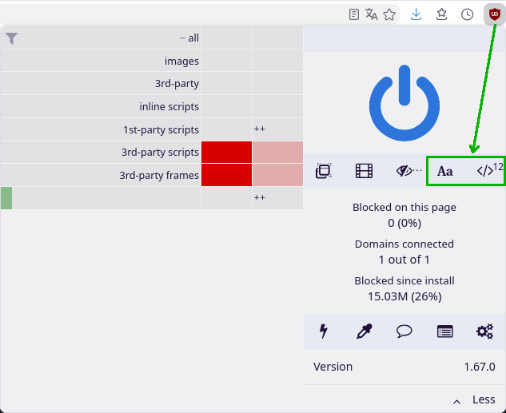

# Introduction

## Welcome

Welcome to **AJATT Grammar Guide**!

The **Common** Grammar Guide.

*Dedicated to all those who learn, want to learn, and **will** learn.*

This guide is a complete re-write and re-arrangement of <a href="https://sakubi.neocities.org/">the Sakubi grammar guide</a>. The full rewrite is <b>still not finished</b>, but the main content and guide are done.

AJATT Grammar Guide is an **open** and **community-maintained** project. We accept all kinds of helpful contributions.

You are welcome to join our [community](https://ajatt.top/blog/join-our-community.html) for feedback, comments, reviews, or just to chat.

If you want to contribute, you can view the project [on github](https://github.com/Ajatt-Tools/grammar) and file issues and pull requests.

**DO NOT** skip reading the [Before you begin](./Before-you-begin.md) and [Preamble](./Preamble.md) pages. They give you instructions on how to use this guide.

## For uBlock users

If you use [uBlock](https://github.com/gorhill/uBlock),
unblock JavaScript and Remote Fonts.

The book's source code is [free/libre software](https://github.com/rust-lang/mdBook),
so we guarantee that those scripts are safe to run.
